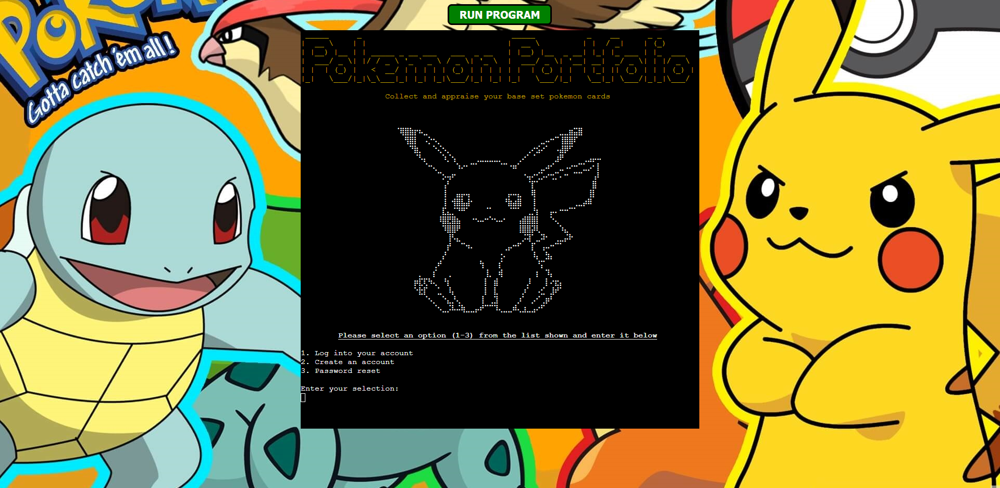
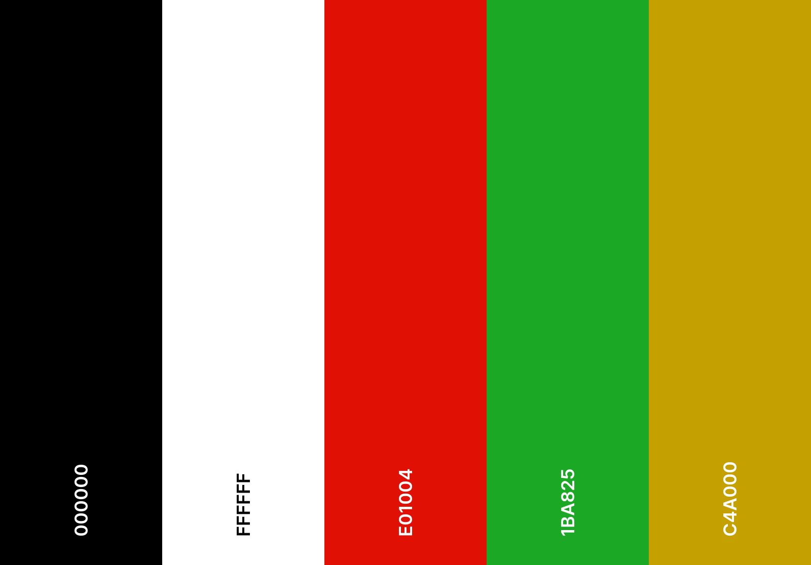
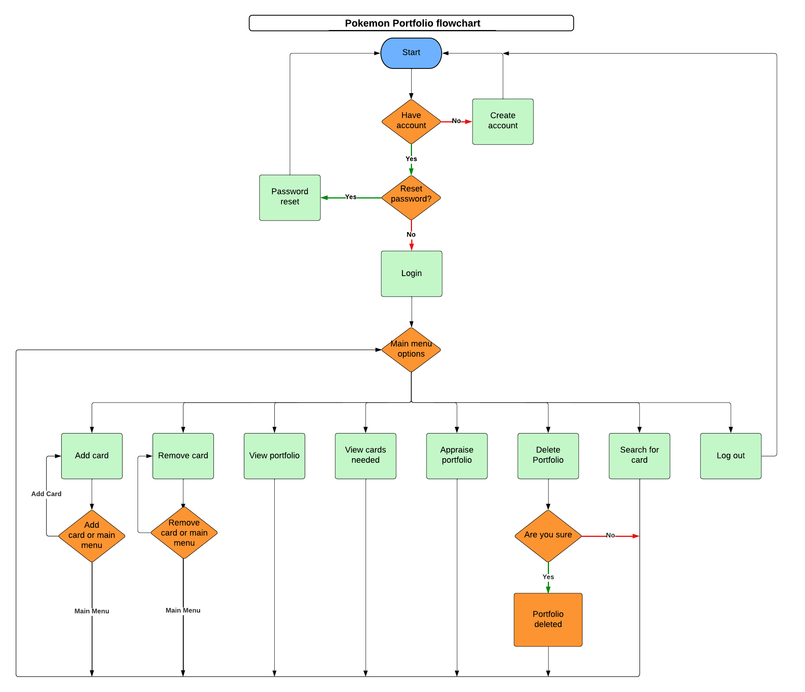

# Pokemon Portfolio

Pokemon Portfolio is a web page terminal application that allows users to manage and appraise their base set pokemon cards.

[Pokemon Portfolio application page on Heroku](https://pokemon-portfolio-158545b3517e.herokuapp.com/)
[Pokemon Portfolio application page on Render](https://ci-p3-pokemon-portfolio.onrender.com/)

# Table of Contents

1. [Introduction](#pokemon-portfolio)
2. [User Experience](#user-experience)
    - [Initial Discussion](#initial-discussion)
    - [User stories](#user-stories)
3. [Design](#design)
    - [Colour scheme](#colour-scheme)
    - [Imagery](#imagery)
    - [Flowchart](#flowchart)
4. [Features](#features)
    - [Create a user account](#create-a-user-account)
    - [User login](#user-login)
    - [Password reset](#password-reset)
    - [Add a card](#add-a-card)
    - [Remove a card](#remove-a-card)
    - [View portfolio](#view-portfolio)
    - [View cards needed to complete collection](#view-cards-needed-to-complete-collection)
    - [Appraise collection](#appraise-collection)
    - [Delete collection](#delete-collection)
    - [Search for card](#search-for-card)
    - [Log out](#log-out)
    - [Input validation](#input-validation)
    - [Future Implementations](#future-implementations)
5. [Technologies used](#technologies-used)
    - [Languages](#languages)
    - [Libraries, Modules, classes imported](#libraries-modules-classes-imported)
    - [Version control](#version-control)
    - [Programs](#programs)
    - [Tools](#tools)
6. [Deployment & Local Deployment](#deployment--local-deployment)
    - [Heroku Deployment](#heroku-deployment)
    - [Local Deployment](#local-deployment)
        - [How to Fork](#how-to-fork)
        - [How to Clone](#how-to-clone)
7. [Testing](#testing)
    - [User story testing](#user-story-testing)
    - [Bugs](#manual-testing-bugs)
8. [Credits](#credits)
    - [Imagery](#images)
    - [Acknowledgements](#acknowledgements)

# User Experience

## Initial Discussion

Pokemon Portfolio is a web based terminal application, that I (Gary Dolan) developed for my third project as part of Code Institutes Diploma in Full Stack Software Development. The app targets people that collect the base set of pokemon cards. It will allow users create a catalogue of the their pokemon cards and manage/appraise their catalogue

## User stories

### Owner / Client goals

-   To ensure the user can easily and intuitively use the app.
-   To create an app that encourages first time learning, keeping consistent colouring, imagery and menu structures across all app features.
-   To create an app that the user enjoys and has fun using. This will be done using imagery, ascii art fonts and ascii art images.
-   To provide the user with all the information they need to use the app correctly.
-   To create an app that encourages users to visit often.
-   To ensure that the user regardless of their actions cannot cause any issues with the app.
-   To create a high level of user feedback while using the app, ensuring the user knows what they can do and what they have done.

### First time visitor goals

-   I want to create an account and login.
-   I want to create a catalogue of my base set pokemon cards.
-   I want to appraise my catalogue of cards.
-   I want the ability to view my collection.
-   I want the ability to view what cards I need to complete my collection.
-   I want the ability to view the details of individual cards.
-   I want the app to be intuitive and easy to use.
-   I want the app to provide me with feedback regarding actions I have taken.
-   I want the ability to log out when I am finished.

### Returning visitor goals

-   I want the ability to login to my account.
-   I want the ability to retrieve my username and reset my password if I have forgotten it.
-   I want to view my collection.
-   I want to manage the cards in my collection.
-   I want the ability to view what cards I need to complete my collection.
-   I want the ability to view the details of individual cards.
-   I want the ability to delete my collection.
-   I want the ability to log out when I am finished.

[Return to Table of Contents](#table-of-contents)

# Design

## Colour scheme

Due to the fact that this application is terminal based, colour choices were limited. The primary objective I wanted to achieve with my colour scheme was to use it as a form of user feedback. I would use green to indicate a positive action or message and red to indicate a negative action or message.

A secondary goal of my colour scheme was to add some style to the application. As it was based mostly in black and white I wanted to add some colour to the app. I used yellow for the page titles and pokemon names when searched. I choose yellow because it is strongly associated with the pokemon brand and has the best visibility when using ascii art fonts.

I used [Coolors](https://coolors.co/) to visualize my palette.

The colour hex codes above were taken directly from the webpage when the app was running using [Google chrome eyedropper extension](https://eyedropper.org/)

## Imagery

Due to the fact that images cannot be displayed in the terminal, I wanted to ensure I used strong bold colours in my webpage [background](https://www.pixelstalk.net/pokemon-hd-backgrounds-free-download/). This adds contrast between the terminal and background and improves user experience.

I also wanted to add images of each of the 102 pokemon in the base card set throughout the app. To do this I use Emoji Combos [image to dot convertor](https://emojicombos.com/dot-art-generator). I generated cards 1 to 69 using images from [pokemon.com](https://www.pokemon.com/us/pokedex) and cards 70 to 102 using images from [tcgplayer.com](https://shop.tcgplayer.com/price-guide/pokemon/base-set-shadowless). Most of these images were edited manually after dot image generation. I discussed copy rights regarding the use of these images with both my mentor and cohort facilitator. Both agreed that there were no issues using the images, mainly because I never use the actual images and also because the app is only for educational purposes.

## Flowchart

The flowchart below was created during the planning stage of the project and was created using [LucidChart](https://www.lucidchart.com/pages/).

# Features

The pokemon portfolio apps features are detailed below.

## Create a user account

Due to the nature of the application the user's data needs to be retained. To do this I added a create an account feature which allows the users to create an account using a username, password and phone number (used for password recovery). Once the account is created a location in a google sheet is assigned to store the information pertaining to that username.

## User login

This feature allows a user, who has already created an account to log into it.

## Password reset

This feature allows a user, who has already created an account to reset their password. Once the user enters the mobile phone number associated with the account, their username will be shown and they can reset their password.

## Add a card

This feature allows a user who has logged in to add a card to their collection.

## Remove a card

This feature allows a user who has logged in to remove a card to their collection.

## View portfolio

This feature allows a user who has logged in to view all the cards in their portfolio. It will also inform the user of what percentage of cards they have collected from the set thus far.

## View cards needed to complete collection

This feature allows a user who has logged in to view all the cards they need to complete their collection. It will also inform the user of what percentage of cards they are missing from the collection.

## Appraise collection

This feature allows a logged in user to appraise their collection. This will show the user the total summed value of all the cards in their collection.

## Delete collection

This feature allows a logged in user to delete all cards stored in their collection. The user will be warned after they select this option and asked to confirm they wish to proceed.

## Search for card

This option allows a user to search for cards by their card number. Once a number is entered, an image of the card / pokemon will be displayed. This will be accompanied by a table showing the card details, these are the number, name, rarity, price and if it is in the users collection.

## Log out

This feature allows the user to log out. The user will be returned to the home page and have the option to login, reset pass or create an account.

## Input validation

While using the app, the user will be asked to make selections and enter data. All the user selections are validated to ensure correctness. User selections are validated to ensure they are a number that is in the list of available options. There is also specific validation for username, password and phone number entry to ensure they comply with the onscreen instructions. An example of user input validation can be seen below.

## Future implementations

In the future I would like to add the following features to the Pokemon Portfolio web-based terminal application,

-   Expand the available card set that the user can work with.
-   Add options to view all cards in specific sets and sort by card details.
-   Add live pricing of cards to the application so card prices update as the market changes.
-   Try to add colour to the pokemon dot art.

[Return to Table of Contents](#table-of-contents)

# Technologies used

## Languages

-   Python - Used to write the application.
-   HTML/CSS - Used to modify the code institute template.

## Libraries, Modules, Classes imported

-   [gspread](https://docs.gspread.org/en/v5.10.0/) - Google sheets functionality (open, read, write etc.).
-   [Credentials](https://google-auth.readthedocs.io/en/master/reference/google.oauth2.service_account.html) from google.oauth2.service_account module - Authenticate and authorize access to Google cloud services using a service account.
-   [pyfiglet](https://pypi.org/project/pyfiglet/0.7/) - Allow for dynamic rendering of ascii text into ascii art fonts.
-   [os](https://docs.python.org/3/library/os.html) - Allows use of operating system dependent functionality.
-   [re](https://docs.python.org/3/library/re.html) - Provides regular expression matching operations.
-   [bcrypt](https://pypi.org/project/bcrypt/) - Password creation using salts and password match checking.
-   [sys](https://docs.python.org/3/library/sys.html) - Imported for access to system-specific parameters and functions such as exit().
-   [time](https://docs.python.org/3/library/time.html) - Access to sleep (delays) for terminal.
-   [colored](https://pypi.org/project/termcolor/) from the termcolor module - Colour printing to terminal.
-   [tabulate](https://pypi.org/project/tabulate/) - Displaying data in custom tables.
-   print pokemon from pokemon_ascii_art module - A module made by me for printing pokemon art from a given card number.

## Version control

-   Git commands - Used via windows powershell (using Posh-Git module).
-   Github.com. - Repository created using code institute student template.
-   Github desktop - Used as a local visual aid between pushing to master. It offers a clean view of all code changes since last commit, commit history etc.

## Programs

-   Microsoft Visual Studio Code.
-   Notepad ++.
-   Photoshop.
-   Inkscape.

## Tools

-   [Lucid Chart](https://www.lucidchart.com/) used to create app flowchart.
-   [Coolors](https://coolors.co/) was used to visualize colour palettes.
-   [Google chrome eyedropper extension ](https://eyedropper.org/) was used to get hex code colour of terminal text.
-   [Pixabay](https://pixabay.com) was used as a source for images.
-   [Favicon convertor](https://favicon.io/favicon-converter/) used to make an icon from an image.
-   [Google](https://www.google.ie/), [Youtube](https://www.youtube.com/) and [wW3schools](https://www.w3schools.com) were used throughout to help solve issues when stuck etc.
-   [W3C CSS validator](https://jigsaw.w3.org/css-validator/) used to validate the CSS.
-   [W3C HTML validator](https://validator.w3.org/nu/) used to validate the HTML.
-   Google and firefox build in dev tools user to test and examine code.
-   Emoji Combos [image to dot convertor](https://emojicombos.com/dot-art-generator) was uses to create and manually edit dot art.
-   [Pylance Validator](https://marketplace.visualstudio.com/items?itemName=ms-python.vscode-pylance) for performant language support in vs code
-   [Scre.io](https://scre.io/) was used to capture video of the app for readme.

-   [Code institutes Pep8 linter](https://pep8ci.herokuapp.com/) was used to ensure python conformed to Pep8 style guidelines.
-   [Heroku](https://heroku.com/) was used for app deployment.

[Return to Table of Contents](#table-of-contents)

# Deployment & Local Deployment

## Heroku Deployment

This application was created using the [Code Institute Python Essentials Template](https://github.com/Code-Institute-Org/p3-template). This template creates a webpage based template that can run python code. For the application to run using the template, the follow changes need to be made to the python code.

1. The newline char(\n) must be added at the end of the text inside all occurrences of the input method, e.g. data=input("text\n")
2. The requirements.txt must be populated with a list of dependencies that the project needs to run. This can be done using the terminal command pip3 freeze > requirements.txt

This application was deployed on Heroku using the following steps,

1. Create a Heroku account and log in.
2. Select create new app from the dashboard.
3. Enter a name for the app, select a region and press create app.
4. From the app homepage select settings.
5. Select reveal config vars.
6. Add a config var with a key or PORT and a value of 8000.
7. Optional - If using google sheets create a config var with a key of CREDS. For the value, paste in the credentials for the google sheet used by the app. For this project a CREDS variable was created using the contents of the creds.json file.
8. From settings select add build pack, select python from the pop up window and press add buildpack.
9. From settings select add build pack, select nodejs from the pop up window and press add buildpack.
10. Select the deploy section from the app homepage.
11. Select Github as the deployment method and connect to Github.
12. In the search bar, enter the name of the repo used for the app and click search.
13. Press connect to link the Heroku app to the repo.
14. Deploy using automatic or manual deployment options at the bottom of the deploy section.

## Local Deployment

### How to Fork

To fork this repository,

1. Log into or signup at [Github](https://github.com).
2. Select the repository for this app.
3. Click the fork button (upper right).

### How to Clone

To clone this repository,

1. Log into or signup at [Github](https://github.com).
2. Select the repository for this app
3. Click the green code button (upper right).
4. Copy the URL using the copy button.
5. Open the terminal in your editor (or of your choosing) and move to the directory which you want to clone to.
6. Type git clone and paste the repository link, then press enter.

[Return to Table of Contents](#table-of-contents)

# Testing

For comprehensive details regarding manual and automatic testing, please refer to [TESTING.md](TESTING.md)

## User story testing

### Owner / Client

-   I want to test if the user can easily and intuitively use the app.

    -   The user is given clear, detailed and easy to understand instructions throughout the application. All available options are displayed with text above explaining how the user should proceed. All choices are in a list format and text explains what the selection will allow the user to do.

-   I want to test if the app encourages first time learning using colouring, imagery and menu structure.

    -   All colouring is consistent throughout the app, green for positive messaging, red for negative and yellow for page headings. The instructional messaging format is consistent throughout the site and differs from the standard format (centred, bold, underlined). The use of ascii font art headings and pokemon images at the top of each menu and feature, along with terminal clearing provides a page like structure so it is easy to learn and navigate.

-   I want to test that the app is enjoyable and is fun to use.

    -   The app contains ascii font art, dot images and coloured text, along with a custom background to encourage the user to have fun and enjoy their time using the app. Pokemon images chosen for feature pages are popular and well known so the user will recognize and enjoy viewing their images as they use the app.

-   I want to test that the user is provided with all the information the need to use the app correctly.

    -   App contains detailed, well formatted instructions, which are straight forward and easy to follow.

-   I want to ensure the app encourages the user to visit often.

    -   The overall apps function encourages the user to return and update their collection each time they obtain a new base set card. The app account creation feature means that the users collection details are retained and can be built upon. Features such as viewing the cards they need to complete their collection and showing the percentage of the collection they have encourages the user to complete their collections, which would in turn bring them back to the app.

-   I want to test that the user regardless of their actions cannot cause any issues with the app.

    -   There is user selection and user input validation for every selection or input that the user can make. No action will occur unless the user selections and inputs conform to the instructions given to the user.

-   I want to test that there is a high level of user feedback while using the app.
    -   Selections and inputs throughout the app provide the user with a high level of feedback. Feedback is given when the user makes a correct selection or input and when the user makes and incorrect selection or input. Where relevant there is messaging when any action takes time, such as loading card detail..., logging in... etc.

### New user

-   I want to create an account and login.
    -   Account creation and login features are available and fully functional.
-   I want to create a catalogue of my base set pokemon cards.
    -   Add card and remove card features allow the user to catalogue their base set pokemon cards.
-   I want to appraise my catalogue of cards.
    -   The appraise portfolio feature will provide this functionality.
-   I want the ability to view my collection.
    -   The view portfolio will allow the user to do this.
-   I want the ability to view what cards I need to complete my collection.
    -   The view cards needed to complete collection option will provide the user with a table listing all the cards they need to complete their collection.
-   I want the ability to view the details of individual cards.
    -   The user can search for a card by number using the search for card option. This will return the image related to the card, the card number, name, rarity, price and if the user currently has the card in their collection.
-   I want the app to be intuitive and easy to use.
    -   The app has easy to follow instructions and straight forward menu structures.
-   I want the app to provide me with feedback regarding actions I have taken.
    -   Selections and inputs throughout the app provide the user with a high level of feedback. Feedback is given when the user makes a correct selection or input and when the user makes and incorrect selection or input. Where relevant there is messaging when any action takes time, such as loading card detail..., logging in... etc.
-   I want the ability to log out when I am finished.
    -   The log out option provides this functionality.

### Returning user

-   I want the ability to login to my account.
    -   Account login feature is available and fully functional.
-   I want the ability to retrieve my username and reset my password if I have forgotten it.
    -   The reset password option will allow the user to reset their password using the phone number that was associated with the account upon creation. Once the associated account is found the username will also be displayed to the user in case the forgot it.
-   I want to view my collection.
    -   The view portfolio will allow the user to do this.
-   I want to manage the cards in my collection.
    -   Add card and remove card features allow the user to manage their base set pokemon card collection.
-   I want the ability to view what cards I need to complete my collection.
    -   The view cards needed to complete collection option will provide the user with a table listing all the cards they need to complete their collection.
-   I want the ability to view the details of individual cards.
    -   The user can search for a card by number using the search for card option. This will return the image related to the card, the card number, name, rarity, price and if the user currently has the card in their collection.
-   I want the ability to delete my collection.
    -   The delete portfolio feature will allow the user to remove all the cards from their collection.
-   I want the ability to log out when I am finished.
    -   The log out option provides this functionality.

## Manual testing bugs

During manual testing some bugs were found and fixed, these were,

### Adding cards bug

This bug was found during testing of add and remove cards featured. If 0 was entered before the given value it crashed the app. This was because the user input was taken and passed to the print pokemon function as a string. The function then it looked to print a pokemon from the pokemon_ascii_art module using an invalid string.

I fixed this bug by ensuring that the value entered but the user was validated and returned as an int. This value was then converted to a string when passed to the print pokemon function. So if the user entered 01, it is validated and returned as 1, this is then passed to print pokemon as "1".

### Update cells bug

This issue occurred when I created a user. Upon creation, the users associated column values needed to be filled with the string "No". I initially implemented this using a for loop, updating each cell one at a time. This caused an error as I exceeded the max writes per min google sheets allows. I fixed this by using a batch update, to update all cell values in one write.

### Main menu bug

During testing of the main menu I found a bug. When the user selected an invalid selection the error messages were not being displayed. The bug was caused by the way I structure the main menu function inside a large while true loop. This meant that after validation of the input the loop repeated and the first statement in the loop cleared the terminal. I fixed this by wrapping the option printing, user input and validating of the options in a while true loop. This meant that upon invalid selection the internal while loop would not break from the loop and the error messages were no longer cleared and could be viewed correctly.

[Return to Table of Contents](#table-of-contents)

# Credits

## Images

-   [Background image](https://www.pixelstalk.net/pokemon-hd-backgrounds-free-download/) by [LTDSCDT]

-   [Favicon image](https://pixabay.com/vectors/pokemon-icon-design-symbol-sign-4657023/) by [Hsaart](https://pixabay.com/users/hsaart-8633812/)
-   Images from [pokemon.com](https://www.pokemon.com/us/pokedex) and [tcgplayer.com](https://shop.tcgplayer.com/price-guide/pokemon/base-set-shadowless) were converted to dot art and manually edited.

## Acknowledgements

I would like to acknowledge the following people for support and guidance during this project,

-   My Mentor Daisy Mc Girr for advice before and during this project.
-   Our Cohort Facilitator Alan Bushell and Fellow students, for their participation on slack via comments, questions and discussions during our weekly meetings, all of which gave further understanding and insight into the course content.

[Return to Table of Contents](#table-of-contents)
