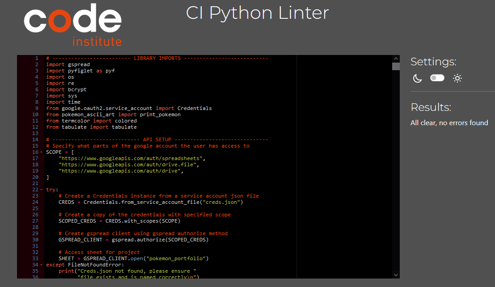
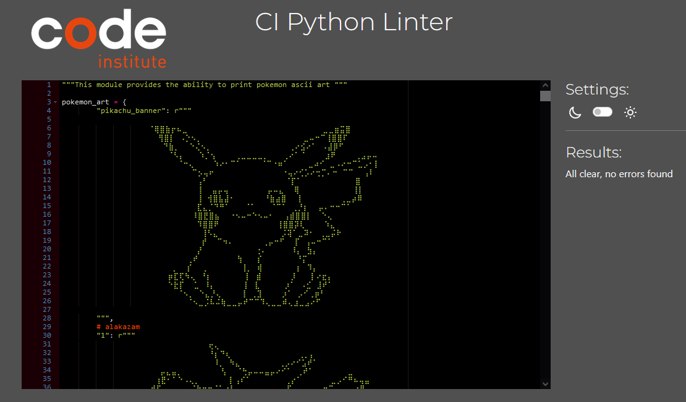

# Pokemon Portfolio Testing

Testing of app was ongoing throughout the development process. I used the developer tools in chrome and firefox to test all aspect of the app.

# Table of Contents

1. [Automated testing](#automated-testing)
2. [Manual testing](#manual-testing)

# Automated testing

##Python
The [Code institutes Pep8 linter](https://pep8ci.herokuapp.com/) was used to ensure the python code conformed to Pep8 style guidelines. The results of these can be seen below.

Run.py Pep8 validation

Pokemon_ascii_art.py Pep8 validation

## HTML
The automated testing of this apps HTML code was carried out using [Validator w3](https://validator.w3.org/nu/), all html pages passed without any errors or warnings, the results are shown below

-   [HTML Test Results](https://validator.w3.org/nu/?doc=https%3A%2F%2Fpokemon-portfolio-158545b3517e.herokuapp.com%2F)

##CSS
The apps CSS was validated using [W3C CSS validator](https://jigsaw.w3.org/css-validator/). The app passed with no errors or warnings and the test results can be seen below.

-   [CSS test results](https://jigsaw.w3.org/css-validator/validator?uri=https%3A%2F%2Fpokemon-portfolio-158545b3517e.herokuapp.com%2F&profile=css3svg&usermedium=all&warning=1&vextwarning=&lang=en).

# Manual testing

The tests for this app listed below were conducted to ensure it correct operation. All tests passed successfully

Home page

| Test                                         | Expected Result                                                                                                        | Pass     |
| -------------------------------------------- | ---------------------------------------------------------------------------------------------------------------------- | -------- |
| Home page - load no errors                   | No errors occur while finding creds file or connecting to google sheets                                                | &#10004; |
| Home page - terminal cleared on entry        | Terminal cleared only home page details displayed                                                                      | &#10004; |
| Home page - title printed correctly          | Ascii font art title printed in yellow and in centre of terminal                                                       | &#10004; |
| Home page - tag line printed correctly       | Tag line printed in yellow and in centre of centre of terminal                                                         | &#10004; |
| Home page - Pokemon image printed correctly  | Pokemon dot art printed correctly                                                                                      | &#10004; |
| Home page - instructions printed correctly   | Instruction printed in bold, centred, white and underlined, showing the correct range                                  | &#10004; |
| Home page - options printed correctly        | List of 3 options (login, create account, password reset)                                                              | &#10004; |
| Home page - selection prompt                 | Prompt appears, requesting selection                                                                                   | &#10004; |
| Home page - invalid selection - out of range | Invalid selection: Available options (1 - 3), you entered 4, please try again displayed (red). Menu & prompt displayed | &#10004; |
| Home page - invalid selection - non integer  | Invalid selection: Your selection kk is not a number, please try again (red). Menu & prompt displayed                  | &#10004; |
| Home page - option 1 selected                | Login page displayed                                                                                                   | &#10004; |
| Home page - option 2 selected                | Account creation page is displayed                                                                                     | &#10004; |
| Home page - option 3 selected                | Password reset page displayed                                                                                          | &#10004; |

Account creation

| Test                                                  | Expected Result                                                                                                  | Pass     |
| ----------------------------------------------------- | ---------------------------------------------------------------------------------------------------------------- | -------- |
| Account creation - terminal cleared on entry          | Terminal cleared only account creation details displayed                                                         | &#10004; |
| Account creation - title printed correctly            | Ascii font art title printed in yellow and in centre of terminal                                                 | &#10004; |
| Account creation - Pokemon image printed correctly    | Pokemon dot art printed correctly                                                                                | &#10004; |
| Account creation - instructions printed correctly     | Instructions printed in bold, centred, white and underlined, showing the correct range                           | &#10004; |
| Account creation - username prompt prints correctly   | Prompt appears, requesting username entry                                                                        | &#10004; |
| Account creation - invalid username (<5)              | Username must be at least 5 characters, please try again. Username prompt displayed                              | &#10004; |
| Account creation - invalid username (>15)             | Username can not be more than 15 characters, please try again. Username prompt displayed                         | &#10004; |
| Account creation - invalid username - unallowed chars | Username can only use letters, numbers, \_ or - Username prompt displayed                                        | &#10004; |
| Account creation - valid username, but unavailable    | Username already in use, please try again. Username prompt displayed                                             | &#10004; |
| Account creation - valid username, available          | Username available. Password prompt displayed                                                                    | &#10004; |
| Account creation - password prompt prints correctly   | Prompt appears, requesting password entry                                                                        | &#10004; |
| Account creation - invalid password (<5)              | Invalid Password: Password must be at least 5 characters, please try again. Password prompt displayed            | &#10004; |
| Account creation - invalid password (>15)             | Invalid Password: Password cannot be more than 15 characters, please try again. Password prompt displayed        | &#10004; |
| Account creation - invalid password - unallowed chars | Invalid Password: Please only use letters, numbers, \_ , - , & or !, please try again. Password prompt displayed | &#10004; |
| Account creation - valid password                     | Phone number prompt displayed                                                                                    | &#10004; |
| Account creation - phone num prompt prints correctly  | Prompt appears, requesting phone number entry                                                                    | &#10004; |
| Account creation - invalid phone num (<10)            | Invalid phone number: Phone number must be at least 10 digits, please try again. Phone num prompt displayed      | &#10004; |
| Account creation - invalid phone num (>15)            | Invalid phone number: Phone number cannot be more than 15 digits, please try again. Phone num prompt displayed   | &#10004; |
| Account creation - invalid phone num- unallowed chars | Invalid phone number: Please only use numbers, please try again. Phone num prompt displayed                      | &#10004; |
| Account creation - valid phone num , but unavailable  | Invalid phone number: Phone number already in use, please try again. Phone num prompt displayed                  | &#10004; |
| Account creation - valid phone num, available         | Creating account.... Account success page displayed.                                                             | &#10004; |

Successful account creation

| Test                                                      | Expected Result                                                                                               | Pass     |
| --------------------------------------------------------- | ------------------------------------------------------------------------------------------------------------- | -------- |
| Successful acc creation - message printed correctly       | Message printed correctly (green, bold, centred, underlined)                                                  | &#10004; |
| Successful acc creation - Pokemon image printed correctly | Pokemon dot art printed correctly                                                                             | &#10004; |
| Successful acc creation - instructions printed correctly  | Instruction printed in bold, centred, white and underlined, showing the correct range                         | &#10004; |
| Successful acc creation - options printed correctly       | List of 2 options (create another account, return to home page)                                               | &#10004; |
| Successful acc creation - selection prompt                | Prompt appears, requesting selection                                                                          | &#10004; |
| Successful acc creation - invalid selection - range       | Invalid selection: Available options (1 - 2), you entered 9, please try again. Inst, menu & prompt displayed  | &#10004; |
| Successful acc creation - invalid selection - non integer | Invalid selection: Your selection kk is not a number, please try again. Instructions, menu & prompt displayed | &#10004; |
| Successful acc creation - option 1 selected               | Account creation page shown. Account creation can be carried out again                                        | &#10004; |
| Successful acc creation - option 2 selected               | Home page is displayed                                                                                        | &#10004; |

Password reset

| Test                                                       | Expected Result                                                                                             | Pass     |
| ---------------------------------------------------------- | ----------------------------------------------------------------------------------------------------------- | -------- |
| Password reset - terminal cleared on entry                 | Terminal cleared only password reset details displayed                                                      | &#10004; |
| Password reset - title printed correctly                   | Ascii font art title printed in yellow and in centre of terminal                                            | &#10004; |
| Password reset - Pokemon image printed correctly           | Pokemon dot art printed correctly                                                                           | &#10004; |
| Password reset - instructions printed correctly            | Instructions printed in bold, centred, white and underlined, showing the correct range                      | &#10004; |
| Password reset - invalid phone num (<10)                   | Invalid phone number: Phone number must be at least 10 digits, please try again. Phone num prompt displayed | &#10004; |
| Password reset - invalid phone num (>15)                   | Invalid phone number: Phone num cannot be more than 15 digits, please try again.Phone num prompt displayed  | &#10004; |
| Password reset - invalid phone num- unallowed chars        | Invalid phone number: Please only use numbers, please try again. Phone num prompt displayed                 | &#10004; |
| Password reset - valid phone num , but not in use          | The phone number entered is not associated with an account. Phone num prompt displayed                      | &#10004; |
| Password reset - valid phone num, in use                   | Checking for account .... Account found, username is garyd. Password prompt                                 | &#10004; |
| acc found pass prompt - invalid password (<5)              | Invalid Password: Password must be at least 5 characters, please try again. Password prompt displayed       | &#10004; |
| acc found pass prompt - invalid password (>15)             | Invalid Password: Password cannot be more than 15 characters, please try again. Password prompt displayed   | &#10004; |
| acc found pass prompt - invalid password - unallowed chars | Invalid Password: Please only use letters, numbers, \_ , - , & or !, please try again. Prompt displayed     | &#10004; |
| acc found pass prompt - valid password                     | Password has been reset. Instructions, menu(reset pass again, return to home page) & prompt displayed.      | &#10004; |
| acc found pass prompt - valid password option 1 selected   | Password reset page shown. Password reset can be carried out again                                          | &#10004; |
| acc found pass prompt - valid password option 1 selected   | Home page is displayed                                                                                      | &#10004; |

Login

| Test                                       | Expected Result                                                                                                  | Pass     |
| ------------------------------------------ | ---------------------------------------------------------------------------------------------------------------- | -------- |
| Login - terminal cleared on entry          | Terminal cleared only login details displayed                                                                    | &#10004; |
| Login - title printed correctly            | Ascii font art title printed in yellow and in centre of terminal                                                 | &#10004; |
| Login - Pokemon image printed correctly    | Pokemon dot art printed correctly                                                                                | &#10004; |
| Login - instructions printed correctly     | Instructions printed in bold, centred, white and underlined, showing the correct range                           | &#10004; |
| Login - username prompt prints correctly   | Prompt appears, requesting username entry                                                                        | &#10004; |
| Login - invalid username (<5)              | Username must be at least 5 characters, please try again. Username prompt displayed                              | &#10004; |
| Login - invalid username (>15)             | Username can not be more than 15 characters, please try again. Username prompt displayed                         | &#10004; |
| Login - invalid username - unallowed chars | Username can only use letters, numbers, \_ or - Username prompt displayed                                        | &#10004; |
| Login - valid username                     | Password prompt displayed                                                                                        | &#10004; |
| Login - password prompt prints correctly   | Prompt appears, requesting password entry                                                                        | &#10004; |
| Login - invalid password (<5)              | Invalid Password: Password must be at least 5 characters, please try again. Password prompt displayed            | &#10004; |
| Login - invalid password (>15)             | Invalid Password: Password cannot be more than 15 characters, please try again. Password prompt displayed        | &#10004; |
| Login - invalid password - unallowed chars | Invalid Password: Please only use letters, numbers, \_ , - , & or !, please try again. Password prompt displayed | &#10004; |
| Login - valid password                     | Logging in .... Login Successful displayed. Main menu shown                                                      | &#10004; |

Main Menu

| Test                                         | Expected Result                                                                                                        | Pass     |
| -------------------------------------------- | ---------------------------------------------------------------------------------------------------------------------- | -------- |
| Main Menu - terminal cleared on entry        | Terminal cleared only main menu details displayed                                                                      | &#10004; |
| Main Menu - title printed correctly          | Ascii font art title printed in yellow and in centre of terminal                                                       | &#10004; |
| Main Menu - Pokemon image printed correctly  | Pokemon dot art printed correctly                                                                                      | &#10004; |
| Main Menu - instructions printed correctly   | Instruction printed in bold, centred, white and underlined, showing the correct range                                  | &#10004; |
| Main Menu - options printed correctly        | List of 8 options (add card, remove card, view portfolio, view needed cards, appraise, delete, search, log out)        | &#10004; |
| Main Menu - selection prompt                 | Prompt appears, requesting selection                                                                                   | &#10004; |
| Main Menu - invalid selection - out of range | Invalid selection: Available options (1 - 8), you entered 9, please try again displayed (red). Menu & prompt displayed | &#10004; |
| Main Menu - invalid selection - non integer  | Invalid selection: Your selection kk is not a number, please try again (red). Menu & prompt displayed                  | &#10004; |
| Main Menu - option 1 selected                | Add card page displayed                                                                                                | &#10004; |
| Main Menu - option 2 selected                | Remove card page displayed                                                                                             | &#10004; |
| Main Menu - option 3 selected                | View portfolio page displayed                                                                                          | &#10004; |
| Main Menu - option 4 selected                | Cards needed page displayed                                                                                            | &#10004; |
| Main Menu - option 5 selected                | Appraise portfolio page displayed                                                                                      | &#10004; |
| Main Menu - option 6 selected                | Delete portfolio page displayed                                                                                        | &#10004; |
| Main Menu - option 7 selected                | Card search page displayed                                                                                             | &#10004; |
| Main Menu - option 8 selected                | Logging out ... Home page displayed                                                                                    | &#10004; |

Add card

| Test                                        | Expected Result                                                                                                        | Pass     |
| ------------------------------------------- | ---------------------------------------------------------------------------------------------------------------------- | -------- |
| Add card - terminal cleared on entry        | Terminal cleared only add card details displayed                                                                       | &#10004; |
| Add card - title printed correctly          | Ascii font art title printed in yellow and in centre of terminal                                                       | &#10004; |
| Add card - Pokemon image printed correctly  | Pokemon dot art printed correctly                                                                                      | &#10004; |
| Add card - input prompt                     | Prompt appears, requesting selection                                                                                   | &#10004; |
| Add card - invalid selection - out of range | Invalid selection: Available options (1 - 102), you entered 103, please try again displayed (red). Prompt re-displayed | &#10004; |
| Add card - invalid selection - non integer  | Invalid selection: Your selection kk is not a number, please try again (red). Prompt re-displayed                      | &#10004; |
| Add card - valid selected, in collection    | This card is already in your collection, Instruction and prompt re-displayed                                           | &#10004; |
| Add card - valid selected                   | Displays add card success page                                                                                         | &#10004; |
| Add card - 1 selected                       | Message displays correct name, Alakazam and number(1), correct pokemon is displayed                                    | &#10004; |
| Add card - 2 selected                       | Message displays correct name, Blastoise and number(2), correct pokemon is displayed                                   | &#10004; |
| Add card - 3 selected                       | Message displays correct name, Chansey and number(3), correct pokemon is displayed                                     | &#10004; |
| Add card - 4 selected                       | Message displays correct name, Charizard and number(4), correct pokemon is displayed                                   | &#10004; |
| Add card - 5 selected                       | Message displays correct name, Clefairy and number(5), correct pokemon is displayed                                    | &#10004; |
| Add card - 6 selected                       | Message displays correct name, Gyarados and number(6), correct pokemon is displayed                                    | &#10004; |
| Add card - 7 selected                       | Message displays correct name, Hitmonchan and number(7), correct pokemon is displayed                                  | &#10004; |
| Add card - 8 selected                       | Message displays correct name, Machamp and number(8), correct pokemon is displayed                                     | &#10004; |
| Add card - 9 selected                       | Message displays correct name, Magneton and number(9), correct pokemon is displayed                                    | &#10004; |
| Add card - 10 selected                      | Message displays correct name, Mewtwo and number(10), correct pokemon is displayed                                     | &#10004; |
| Add card - 11 selected                      | Message displays correct name, Nidoking and number(11), correct pokemon is displayed                                   | &#10004; |
| Add card - 12 selected                      | Message displays correct name, Ninetales and number(12), correct pokemon is displayed                                  | &#10004; |
| Add card - 13 selected                      | Message displays correct name, Poliwrath and number(13), correct pokemon is displayed                                  | &#10004; |
| Add card - 14 selected                      | Message displays correct name, Raichu and number(14), correct pokemon is displayed                                     | &#10004; |
| Add card - 15 selected                      | Message displays correct name, Venusaur and number(15), correct pokemon is displayed                                   | &#10004; |
| Add card - 16 selected                      | Message displays correct name, Zapdos and number(16), correct pokemon is displayed                                     | &#10004; |
| Add card - 17 selected                      | Message displays correct name, Beedrill and number(17), correct pokemon is displayed                                   | &#10004; |
| Add card - 18 selected                      | Message displays correct name, Dragonair and number(18), correct pokemon is displayed                                  | &#10004; |
| Add card - 19 selected                      | Message displays correct name, Dugtrio and number(19), correct pokemon is displayed                                    | &#10004; |
| Add card - 20 selected                      | Message displays correct name, Electabuzz and number(20), correct pokemon is displayed                                 | &#10004; |
| Add card - 21 selected                      | Message displays correct name, Electrode and number(21), correct pokemon is displayed                                  | &#10004; |
| Add card - 22 selected                      | Message displays correct name, Pidgeotto and number(22), correct pokemon is displayed                                  | &#10004; |
| Add card - 23 selected                      | Message displays correct name, Arcanine and number(23), correct pokemon is displayed                                   | &#10004; |
| Add card - 24 selected                      | Message displays correct name, Charmeleon and number(24), correct pokemon is displayed                                 | &#10004; |
| Add card - 25 selected                      | Message displays correct name, Dewgong and number(25), correct pokemon is displayed                                    | &#10004; |
| Add card - 26 selected                      | Message displays correct name, Dratini and number(26), correct pokemon is displayed                                    | &#10004; |
| Add card - 27 selected                      | Message displays correct name, Farfetch'd and number(27), correct pokemon is displayed                                 | &#10004; |
| Add card - 28 selected                      | Message displays correct name, Growlithe and number(28), correct pokemon is displayed                                  | &#10004; |
| Add card - 29 selected                      | Message displays correct name, Haunter and number(29), correct pokemon is displayed                                    | &#10004; |
| Add card - 30 selected                      | Message displays correct name, Ivysaur and number(30), correct pokemon is displayed                                    | &#10004; |
| Add card - 31 selected                      | Message displays correct name, Jynx and number(31), correct pokemon is displayed                                       | &#10004; |
| Add card - 32 selected                      | Message displays correct name, Kadabra and number(32), correct pokemon is displayed                                    | &#10004; |
| Add card - 33 selected                      | Message displays correct name, Kakuna and number(33), correct pokemon is displayed                                     | &#10004; |
| Add card - 34 selected                      | Message displays correct name, Machoke and number(34), correct pokemon is displayed                                    | &#10004; |
| Add card - 35 selected                      | Message displays correct name, Magikarp and number(35), correct pokemon is displayed                                   | &#10004; |
| Add card - 36 selected                      | Message displays correct name, Magmar and number(36), correct pokemon is displayed                                     | &#10004; |
| Add card - 37 selected                      | Message displays correct name, Nidorino and number(37), correct pokemon is displayed                                   | &#10004; |
| Add card - 38 selected                      | Message displays correct name, Poliwhirl and number(38), correct pokemon is displayed                                  | &#10004; |
| Add card - 39 selected                      | Message displays correct name, Porygon and number(39), correct pokemon is displayed                                    | &#10004; |
| Add card - 40 selected                      | Message displays correct name, Raticate and number(40), correct pokemon is displayed                                   | &#10004; |
| Add card - 41 selected                      | Message displays correct name, Seel and number(41), correct pokemon is displayed                                       | &#10004; |
| Add card - 42 selected                      | Message displays correct name, Wartortle and number(42), correct pokemon is displayed                                  | &#10004; |
| Add card - 43 selected                      | Message displays correct name, Abra and number(43), correct pokemon is displayed                                       | &#10004; |
| Add card - 44 selected                      | Message displays correct name, Bulbasaur and number(44), correct pokemon is displayed                                  | &#10004; |
| Add card - 45 selected                      | Message displays correct name, Caterpie and number(45), correct pokemon is displayed                                   | &#10004; |
| Add card - 46 selected                      | Message displays correct name, Charmander and number(46), correct pokemon is displayed                                 | &#10004; |
| Add card - 47 selected                      | Message displays correct name, Diglett and number(47), correct pokemon is displayed                                    | &#10004; |
| Add card - 48 selected                      | Message displays correct name, Doduo and number(48), correct pokemon is displayed                                      | &#10004; |
| Add card - 49 selected                      | Message displays correct name, Drowzee and number(49), correct pokemon is displayed                                    | &#10004; |
| Add card - 50 selected                      | Message displays correct name, Gastly and number(50), correct pokemon is displayed                                     | &#10004; |
| Add card - 51 selected                      | Message displays correct name, Koffing and number(51), correct pokemon is displayed                                    | &#10004; |
| Add card - 52 selected                      | Message displays correct name, Machop and number(52), correct pokemon is displayed                                     | &#10004; |
| Add card - 53 selected                      | Message displays correct name, Magnemite and number(53), correct pokemon is displayed                                  | &#10004; |
| Add card - 54 selected                      | Message displays correct name, Metapod and number(54), correct pokemon is displayed                                    | &#10004; |
| Add card - 55 selected                      | Message displays correct name, Nidoran M and number(55), correct pokemon is displayed                                  | &#10004; |
| Add card - 56 selected                      | Message displays correct name, Onix and number(56), correct pokemon is displayed                                       | &#10004; |
| Add card - 57 selected                      | Message displays correct name, Pidgey and number(57), correct pokemon is displayed                                     | &#10004; |
| Add card - 58 selected                      | Message displays correct name, Pikachu and number(58), correct pokemon is displayed                                    | &#10004; |
| Add card - 59 selected                      | Message displays correct name, Poliwag and number(59), correct pokemon is displayed                                    | &#10004; |
| Add card - 60 selected                      | Message displays correct name, Ponyta and number(60), correct pokemon is displayed                                     | &#10004; |
| Add card - 61 selected                      | Message displays correct name, Rattata and number(61), correct pokemon is displayed                                    | &#10004; |
| Add card - 62 selected                      | Message displays correct name, Sandshrew and number(62), correct pokemon is displayed                                  | &#10004; |
| Add card - 63 selected                      | Message displays correct name, Squirtle and number(63), correct pokemon is displayed                                   | &#10004; |
| Add card - 64 selected                      | Message displays correct name, Starmie and number(64), correct pokemon is displayed                                    | &#10004; |
| Add card - 65 selected                      | Message displays correct name, Staryu and number(65), correct pokemon is displayed                                     | &#10004; |
| Add card - 66 selected                      | Message displays correct name, Tangela and number(66), correct pokemon is displayed                                    | &#10004; |
| Add card - 67 selected                      | Message displays correct name, Voltorb and number(67), correct pokemon is displayed                                    | &#10004; |
| Add card - 68 selected                      | Message displays correct name, Vulpix and number(68), correct pokemon is displayed                                     | &#10004; |
| Add card - 69 selected                      | Message displays correct name, Weedle and number(69), correct pokemon is displayed                                     | &#10004; |
| Add card - 70 selected                      | Message displays correct name, Clefairy Doll and number(70), correct pokemon is displayed                              | &#10004; |
| Add card - 71 selected                      | Message displays correct name, Comp Search and number(71), correct pokemon is displayed                                | &#10004; |
| Add card - 72 selected                      | Message displays correct name, Dev Spray and number(72), correct pokemon is displayed                                  | &#10004; |
| Add card - 73 selected                      | Message displays correct name, Impostor Prof and number(73), correct pokemon is displayed                              | &#10004; |
| Add card - 74 selected                      | Message displays correct name, Item Finder and number(74), correct pokemon is displayed                                | &#10004; |
| Add card - 75 selected                      | Message displays correct name, Lass and number(75), correct pokemon is displayed                                       | &#10004; |
| Add card - 76 selected                      | Message displays correct name, Breeder and number(76), correct pokemon is displayed                                    | &#10004; |
| Add card - 77 selected                      | Message displays correct name, Trader and number(77), correct pokemon is displayed                                     | &#10004; |
| Add card - 78 selected                      | Message displays correct name, Scoop Up and number(78), correct pokemon is displayed                                   | &#10004; |
| Add card - 79 selected                      | Message displays correct name, S Removal and number(79), correct pokemon is displayed                                  | &#10004; |
| Add card - 80 selected                      | Message displays correct name, Defender and number(80), correct pokemon is displayed                                   | &#10004; |
| Add card - 81 selected                      | Message displays correct name, E Retrieval and number(81), correct pokemon is displayed                                | &#10004; |
| Add card - 82 selected                      | Message displays correct name, Full Heal and number(82), correct pokemon is displayed                                  | &#10004; |
| Add card - 83 selected                      | Message displays correct name, Maintenance and number(83), correct pokemon is displayed                                | &#10004; |
| Add card - 84 selected                      | Message displays correct name, PlusPower and number(84), correct pokemon is displayed                                  | &#10004; |
| Add card - 85 selected                      | Message displays correct name, Pk centre and number(85), correct pokemon is displayed                                  | &#10004; |
| Add card - 86 selected                      | Message displays correct name, Pk Flute and number(86), correct pokemon is displayed                                   | &#10004; |
| Add card - 87 selected                      | Message displays correct name, Pokedex and number(87), correct pokemon is displayed                                    | &#10004; |
| Add card - 88 selected                      | Message displays correct name, Professor Oak and number(88), correct pokemon is displayed                              | &#10004; |
| Add card - 89 selected                      | Message displays correct name, Revive and number(89), correct pokemon is displayed                                     | &#10004; |
| Add card - 90 selected                      | Message displays correct name, Super Potion and number(90), correct pokemon is displayed                               | &#10004; |
| Add card - 91 selected                      | Message displays correct name, Bill and number(91), correct pokemon is displayed                                       | &#10004; |
| Add card - 92 selected                      | Message displays correct name, E Removal and number(92), correct pokemon is displayed                                  | &#10004; |
| Add card - 93 selected                      | Message displays correct name, Gust of Wind and number(93), correct pokemon is displayed                               | &#10004; |
| Add card - 94 selected                      | Message displays correct name, Potion and number(94), correct pokemon is displayed                                     | &#10004; |
| Add card - 95 selected                      | Message displays correct name, Switch and number(95), correct pokemon is displayed                                     | &#10004; |
| Add card - 96 selected                      | Message displays correct name, Colorless E and number(96), correct pokemon is displayed                                | &#10004; |
| Add card - 97 selected                      | Message displays correct name, Fighting E and number(97), correct pokemon is displayed                                 | &#10004; |
| Add card - 98 selected                      | Message displays correct name, Fire E and number(98), correct pokemon is displayed                                     | &#10004; |
| Add card - 99 selected                      | Message displays correct name, Grass E and number(99), correct pokemon is displayed                                    | &#10004; |
| Add card - 100 selected                     | Message displays correct name, Lightning E and number(100), correct pokemon is displayed                               | &#10004; |
| Add card - 101 selected                     | Message displays correct name, Psychic E and number(101), correct pokemon is displayed                                 | &#10004; |
| Add card - 102 selected                     | Message displays correct name, Water E and number(102), correct pokemon is displayed                                   | &#10004; |

Add card success

| Test                                                | Expected Result                                                                                       | Pass     |
| --------------------------------------------------- | ----------------------------------------------------------------------------------------------------- | -------- |
| Add card success - terminal cleared on entry        | Terminal cleared only add card success page details displayed                                         | &#10004; |
| Add card success - message displayed correctly      | You have successfully added Blastoise, card No.2 printed in green, centred, bold and underlined       | &#10004; |
| Add card success - Pokemon image printed correctly  | Pokemon dot art printed correctly                                                                     | &#10004; |
| Add card success - options printed correctly        | List of 2 options (Add another card, Return to main menu)                                             | &#10004; |
| Add card success - invalid selection - out of range | Invalid selection: Available options (1 - 2), you entered 14, please try again. Prompt re-displayed   | &#10004; |
| Add card success - invalid selection - non integer  | Invalid selection: Your selection kk is not a number, please try again (red). Menu & prompt displayed | &#10004; |
| Add card success - option 1 selected                | Add card page shown. Adding card can be carried out again                                             | &#10004; |
| Add card success - option 2                         | Main menu is displayed                                                                                | &#10004; |

Remove card

| Test                                            | Expected Result                                                                                                        | Pass     |
| ----------------------------------------------- | ---------------------------------------------------------------------------------------------------------------------- | -------- |
| Remove card - terminal cleared on entry         | Terminal cleared only remove card details displayed                                                                    | &#10004; |
| Remove card - title printed correctly           | Ascii font art title printed in yellow and in centre of terminal                                                       | &#10004; |
| Remove card - Pokemon image printed correctly   | Pokemon dot art printed correctly                                                                                      | &#10004; |
| Remove card - input prompt                      | Prompt appears, requesting selection                                                                                   | &#10004; |
| Remove card - invalid selection - out of range  | Invalid selection: Available options (1 - 102), you entered 103, please try again displayed (red). Prompt re-displayed | &#10004; |
| Remove card - invalid selection - non integer   | Invalid selection: Your selection kk is not a number, please try again (red). Prompt re-displayed                      | &#10004; |
| Remove card - valid selected, not in collection | You do not have this card in your collection, Instruction and prompt re-displayed                                      | &#10004; |
| Remove card - valid selected, in collection     | Displays remove card success page                                                                                      | &#10004; |
| Remove card - 1 selected                        | Message displays correct name, Alakazam and number(1), correct pokemon is displayed                                    | &#10004; |
| Remove card - 2 selected                        | Message displays correct name, Blastoise and number(2), correct pokemon is displayed                                   | &#10004; |
| Remove card - 3 selected                        | Message displays correct name, Chansey and number(3), correct pokemon is displayed                                     | &#10004; |
| Remove card - 4 selected                        | Message displays correct name, Charizard and number(4), correct pokemon is displayed                                   | &#10004; |
| Remove card - 5 selected                        | Message displays correct name, Clefairy and number(5), correct pokemon is displayed                                    | &#10004; |
| Remove card - 6 selected                        | Message displays correct name, Gyarados and number(6), correct pokemon is displayed                                    | &#10004; |
| Remove card - 7 selected                        | Message displays correct name, Hitmonchan and number(7), correct pokemon is displayed                                  | &#10004; |
| Remove card - 8 selected                        | Message displays correct name, Machamp and number(8), correct pokemon is displayed                                     | &#10004; |
| Remove card - 9 selected                        | Message displays correct name, Magneton and number(9), correct pokemon is displayed                                    | &#10004; |
| Remove card - 10 selected                       | Message displays correct name, Mewtwo and number(10), correct pokemon is displayed                                     | &#10004; |
| Remove card - 11 selected                       | Message displays correct name, Nidoking and number(11), correct pokemon is displayed                                   | &#10004; |
| Remove card - 12 selected                       | Message displays correct name, Ninetales and number(12), correct pokemon is displayed                                  | &#10004; |
| Remove card - 13 selected                       | Message displays correct name, Poliwrath and number(13), correct pokemon is displayed                                  | &#10004; |
| Remove card - 14 selected                       | Message displays correct name, Raichu and number(14), correct pokemon is displayed                                     | &#10004; |
| Remove card - 15 selected                       | Message displays correct name, Venusaur and number(15), correct pokemon is displayed                                   | &#10004; |
| Remove card - 16 selected                       | Message displays correct name, Zapdos and number(16), correct pokemon is displayed                                     | &#10004; |
| Remove card - 17 selected                       | Message displays correct name, Beedrill and number(17), correct pokemon is displayed                                   | &#10004; |
| Remove card - 18 selected                       | Message displays correct name, Dragonair and number(18), correct pokemon is displayed                                  | &#10004; |
| Remove card - 19 selected                       | Message displays correct name, Dugtrio and number(19), correct pokemon is displayed                                    | &#10004; |
| Remove card - 20 selected                       | Message displays correct name, Electabuzz and number(20), correct pokemon is displayed                                 | &#10004; |
| Remove card - 21 selected                       | Message displays correct name, Electrode and number(21), correct pokemon is displayed                                  | &#10004; |
| Remove card - 22 selected                       | Message displays correct name, Pidgeotto and number(22), correct pokemon is displayed                                  | &#10004; |
| Remove card - 23 selected                       | Message displays correct name, Arcanine and number(23), correct pokemon is displayed                                   | &#10004; |
| Remove card - 24 selected                       | Message displays correct name, Charmeleon and number(24), correct pokemon is displayed                                 | &#10004; |
| Remove card - 25 selected                       | Message displays correct name, Dewgong and number(25), correct pokemon is displayed                                    | &#10004; |
| Remove card - 26 selected                       | Message displays correct name, Dratini and number(26), correct pokemon is displayed                                    | &#10004; |
| Remove card - 27 selected                       | Message displays correct name, Farfetch'd and number(27), correct pokemon is displayed                                 | &#10004; |
| Remove card - 28 selected                       | Message displays correct name, Growlithe and number(28), correct pokemon is displayed                                  | &#10004; |
| Remove card - 29 selected                       | Message displays correct name, Haunter and number(29), correct pokemon is displayed                                    | &#10004; |
| Remove card - 30 selected                       | Message displays correct name, Ivysaur and number(30), correct pokemon is displayed                                    | &#10004; |
| Remove card - 31 selected                       | Message displays correct name, Jynx and number(31), correct pokemon is displayed                                       | &#10004; |
| Remove card - 32 selected                       | Message displays correct name, Kadabra and number(32), correct pokemon is displayed                                    | &#10004; |
| Remove card - 33 selected                       | Message displays correct name, Kakuna and number(33), correct pokemon is displayed                                     | &#10004; |
| Remove card - 34 selected                       | Message displays correct name, Machoke and number(34), correct pokemon is displayed                                    | &#10004; |
| Remove card - 35 selected                       | Message displays correct name, Magikarp and number(35), correct pokemon is displayed                                   | &#10004; |
| Remove card - 36 selected                       | Message displays correct name, Magmar and number(36), correct pokemon is displayed                                     | &#10004; |
| Remove card - 37 selected                       | Message displays correct name, Nidorino and number(37), correct pokemon is displayed                                   | &#10004; |
| Remove card - 38 selected                       | Message displays correct name, Poliwhirl and number(38), correct pokemon is displayed                                  | &#10004; |
| Remove card - 39 selected                       | Message displays correct name, Porygon and number(39), correct pokemon is displayed                                    | &#10004; |
| Remove card - 40 selected                       | Message displays correct name, Raticate and number(40), correct pokemon is displayed                                   | &#10004; |
| Remove card - 41 selected                       | Message displays correct name, Seel and number(41), correct pokemon is displayed                                       | &#10004; |
| Remove card - 42 selected                       | Message displays correct name, Wartortle and number(42), correct pokemon is displayed                                  | &#10004; |
| Remove card - 43 selected                       | Message displays correct name, Abra and number(43), correct pokemon is displayed                                       | &#10004; |
| Remove card - 44 selected                       | Message displays correct name, Bulbasaur and number(44), correct pokemon is displayed                                  | &#10004; |
| Remove card - 45 selected                       | Message displays correct name, Caterpie and number(45), correct pokemon is displayed                                   | &#10004; |
| Remove card - 46 selected                       | Message displays correct name, Charmander and number(46), correct pokemon is displayed                                 | &#10004; |
| Remove card - 47 selected                       | Message displays correct name, Diglett and number(47), correct pokemon is displayed                                    | &#10004; |
| Remove card - 48 selected                       | Message displays correct name, Doduo and number(48), correct pokemon is displayed                                      | &#10004; |
| Remove card - 49 selected                       | Message displays correct name, Drowzee and number(49), correct pokemon is displayed                                    | &#10004; |
| Remove card - 50 selected                       | Message displays correct name, Gastly and number(50), correct pokemon is displayed                                     | &#10004; |
| Remove card - 51 selected                       | Message displays correct name, Koffing and number(51), correct pokemon is displayed                                    | &#10004; |
| Remove card - 52 selected                       | Message displays correct name, Machop and number(52), correct pokemon is displayed                                     | &#10004; |
| Remove card - 53 selected                       | Message displays correct name, Magnemite and number(53), correct pokemon is displayed                                  | &#10004; |
| Remove card - 54 selected                       | Message displays correct name, Metapod and number(54), correct pokemon is displayed                                    | &#10004; |
| Remove card - 55 selected                       | Message displays correct name, Nidoran M and number(55), correct pokemon is displayed                                  | &#10004; |
| Remove card - 56 selected                       | Message displays correct name, Onix and number(56), correct pokemon is displayed                                       | &#10004; |
| Remove card - 57 selected                       | Message displays correct name, Pidgey and number(57), correct pokemon is displayed                                     | &#10004; |
| Remove card - 58 selected                       | Message displays correct name, Pikachu and number(58), correct pokemon is displayed                                    | &#10004; |
| Remove card - 59 selected                       | Message displays correct name, Poliwag and number(59), correct pokemon is displayed                                    | &#10004; |
| Remove card - 60 selected                       | Message displays correct name, Ponyta and number(60), correct pokemon is displayed                                     | &#10004; |
| Remove card - 61 selected                       | Message displays correct name, Rattata and number(61), correct pokemon is displayed                                    | &#10004; |
| Remove card - 62 selected                       | Message displays correct name, Sandshrew and number(62), correct pokemon is displayed                                  | &#10004; |
| Remove card - 63 selected                       | Message displays correct name, Squirtle and number(63), correct pokemon is displayed                                   | &#10004; |
| Remove card - 64 selected                       | Message displays correct name, Starmie and number(64), correct pokemon is displayed                                    | &#10004; |
| Remove card - 65 selected                       | Message displays correct name, Staryu and number(65), correct pokemon is displayed                                     | &#10004; |
| Remove card - 66 selected                       | Message displays correct name, Tangela and number(66), correct pokemon is displayed                                    | &#10004; |
| Remove card - 67 selected                       | Message displays correct name, Voltorb and number(67), correct pokemon is displayed                                    | &#10004; |
| Remove card - 68 selected                       | Message displays correct name, Vulpix and number(68), correct pokemon is displayed                                     | &#10004; |
| Remove card - 69 selected                       | Message displays correct name, Weedle and number(69), correct pokemon is displayed                                     | &#10004; |
| Remove card - 70 selected                       | Message displays correct name, Clefairy Doll and number(70), correct pokemon is displayed                              | &#10004; |
| Remove card - 71 selected                       | Message displays correct name, Comp Search and number(71), correct pokemon is displayed                                | &#10004; |
| Remove card - 72 selected                       | Message displays correct name, Dev Spray and number(72), correct pokemon is displayed                                  | &#10004; |
| Remove card - 73 selected                       | Message displays correct name, Impostor Prof and number(73), correct pokemon is displayed                              | &#10004; |
| Remove card - 74 selected                       | Message displays correct name, Item Finder and number(74), correct pokemon is displayed                                | &#10004; |
| Remove card - 75 selected                       | Message displays correct name, Lass and number(75), correct pokemon is displayed                                       | &#10004; |
| Remove card - 76 selected                       | Message displays correct name, Breeder and number(76), correct pokemon is displayed                                    | &#10004; |
| Remove card - 77 selected                       | Message displays correct name, Trader and number(77), correct pokemon is displayed                                     | &#10004; |
| Remove card - 78 selected                       | Message displays correct name, Scoop Up and number(78), correct pokemon is displayed                                   | &#10004; |
| Remove card - 79 selected                       | Message displays correct name, S Removal and number(79), correct pokemon is displayed                                  | &#10004; |
| Remove card - 80 selected                       | Message displays correct name, Defender and number(80), correct pokemon is displayed                                   | &#10004; |
| Remove card - 81 selected                       | Message displays correct name, E Retrieval and number(81), correct pokemon is displayed                                | &#10004; |
| Remove card - 82 selected                       | Message displays correct name, Full Heal and number(82), correct pokemon is displayed                                  | &#10004; |
| Remove card - 83 selected                       | Message displays correct name, Maintenance and number(83), correct pokemon is displayed                                | &#10004; |
| Remove card - 84 selected                       | Message displays correct name, PlusPower and number(84), correct pokemon is displayed                                  | &#10004; |
| Remove card - 85 selected                       | Message displays correct name, Pk centre and number(85), correct pokemon is displayed                                  | &#10004; |
| Remove card - 86 selected                       | Message displays correct name, Pk Flute and number(86), correct pokemon is displayed                                   | &#10004; |
| Remove card - 87 selected                       | Message displays correct name, Pokedex and number(87), correct pokemon is displayed                                    | &#10004; |
| Remove card - 88 selected                       | Message displays correct name, Professor Oak and number(88), correct pokemon is displayed                              | &#10004; |
| Remove card - 89 selected                       | Message displays correct name, Revive and number(89), correct pokemon is displayed                                     | &#10004; |
| Remove card - 90 selected                       | Message displays correct name, Super Potion and number(90), correct pokemon is displayed                               | &#10004; |
| Remove card - 91 selected                       | Message displays correct name, Bill and number(91), correct pokemon is displayed                                       | &#10004; |
| Remove card - 92 selected                       | Message displays correct name, E Removal and number(92), correct pokemon is displayed                                  | &#10004; |
| Remove card - 93 selected                       | Message displays correct name, Gust of Wind and number(93), correct pokemon is displayed                               | &#10004; |
| Remove card - 94 selected                       | Message displays correct name, Potion and number(94), correct pokemon is displayed                                     | &#10004; |
| Remove card - 95 selected                       | Message displays correct name, Switch and number(95), correct pokemon is displayed                                     | &#10004; |
| Remove card - 96 selected                       | Message displays correct name, Colorless E and number(96), correct pokemon is displayed                                | &#10004; |
| Remove card - 97 selected                       | Message displays correct name, Fighting E and number(97), correct pokemon is displayed                                 | &#10004; |
| Remove card - 98 selected                       | Message displays correct name, Fire E and number(98), correct pokemon is displayed                                     | &#10004; |
| Remove card - 99 selected                       | Message displays correct name, Grass E and number(99), correct pokemon is displayed                                    | &#10004; |
| Remove card - 100 selected                      | Message displays correct name, Lightning E and number(100), correct pokemon is displayed                               | &#10004; |
| Remove card - 101 selected                      | Message displays correct name, Psychic E and number(101), correct pokemon is displayed                                 | &#10004; |
| Remove card - 102 selected                      | Message displays correct name, Water E and number(102), correct pokemon is displayed                                   | &#10004; |

Remove card success

| Test                                                   | Expected Result                                                                                       | Pass     |
| ------------------------------------------------------ | ----------------------------------------------------------------------------------------------------- | -------- |
| Remove card success - terminal cleared on entry        | Terminal cleared only Remove card success page details displayed                                      | &#10004; |
| Remove card success - message displayed correctly      | You have successfully removed Alakazam, card No.1 printed in green, centred, bold and underlined      | &#10004; |
| Remove card success - Pokemon image printed correctly  | Pokemon dot art printed correctly                                                                     | &#10004; |
| Remove card success - options printed correctly        | List of 2 options (Remove another card, Return to main menu)                                          | &#10004; |
| Remove card success - invalid selection - out of range | Invalid selection: Available options (1 - 2), you entered 14, please try again. Prompt re-displayed   | &#10004; |
| Remove card success - invalid selection - non integer  | Invalid selection: Your selection kk is not a number, please try again (red). Menu & prompt displayed | &#10004; |
| Remove card success - option 1 selected                | Remove card page shown. Adding card can be carried out again                                          | &#10004; |
| Remove card success - option 2                         | Main menu is displayed                                                                                | &#10004; |

View portfolio 

| Test                                       | Expected Result                                                          | Pass     |
| ------------------------------------------ | ------------------------------------------------------------------------ | -------- |
| View portfolio - terminal cleared on entry | Terminal cleared only view portfolio details displayed                   | &#10004; |
| View portfolio - title printed correctly   | Ascii font art title printed in yellow and in centre of terminal         | &#10004; |
| View portfolio - Portfolio displayed       | Portfolio of pokemon card is displayed in a table                        | &#10004; |
| View portfolio - Collection % displayed    | You have collected 2%, of available cards in this set is displayed       | &#10004; |
| View portfolio - 0 cards in collection     | You do not have any cards in you collection is displayed, no table shown | &#10004; |
| View portfolio - All cards in collection   | Congratulations, your set is %100 complete                               | &#10004; |
| View portfolio - input prompt              | Prompt appears, requesting user hits enter to exit                       | &#10004; |
| View portfolio - Enter pressed             | Main menu is displayed                                                   | &#10004; |

Cards needed

| Test                                             | Expected Result                                                          | Pass     |
| ------------------------------------------------ | ------------------------------------------------------------------------ | -------- |
| Cards needed - terminal cleared on entry         | Terminal cleared only cards needed details displayed                     | &#10004; |
| Cards needed - title printed correctly           | Ascii font art title printed in yellow and in centre of terminal         | &#10004; |
| Cards needed - Portfolio displayed               | Table of cards needed is displayed                                       | &#10004; |
| Cards needed - Collection % displayed            | You have collected 2%, of available cards in this set is displayed       | &#10004; |
| Cards needed - Portfolio (0 cards in collection) | You do not have any cards in you collection is displayed, no table shown | &#10004; |
| Cards needed - All cards in collection           | Your collection is 100% complete, CONGRATULATIONS, no table shown        | &#10004; |
| Cards needed - input prompt                      | Prompt appears, requesting user hits enter to exit                       | &#10004; |
| Cards needed - Enter pressed                     | Main menu is displayed                                                   | &#10004; |

Appraise portfolio

| Test                                                 | Expected Result                                                              | Pass     |
| ---------------------------------------------------- | ---------------------------------------------------------------------------- | -------- |
| Appraise portfolio - terminal cleared on entry       | Terminal cleared only remove card details displayed                          | &#10004; |
| Appraise portfolio - title printed correctly         | Ascii font art title printed in yellow and in centre of terminal             | &#10004; |
| Appraise portfolio - Pokemon image printed correctly | Pokemon dot art printed correctly                                            | &#10004; |
| Appraise portfolio - value message printed correctly | Your pokemon portfolio value is, $7178.36 (green, centred, underlined, bold) | &#10004; |
| Appraise portfolio - Font art value                  | Ascii font art for value printed in white and in centre of terminal          | &#10004; |
| Appraise portfolio - input prompt                    | Prompt appears, requesting user hits enter to exit                           | &#10004; |
| Appraise portfolio - Enter pressed                   | Main menu is displayed                                                       |

Delete portfolio confirm

| Test                                                   | Expected Result                                                                                                 | Pass     |
| ------------------------------------------------------ | --------------------------------------------------------------------------------------------------------------- | -------- |
| Delete port confirm - terminal cleared on entry        | Terminal cleared only remove card details displayed                                                             | &#10004; |
| Delete port confirm - title printed correctly          | Ascii font art title printed in yellow and in centre of terminal                                                | &#10004; |
| Delete port confirm - Pokemon image printed correctly  | Pokemon dot art printed correctly                                                                               | &#10004; |
| Delete port confirm - instructions printed correctly   | Instruction printed in bold, centred, white and underlined, showing the correct range                           | &#10004; |
| Delete port confirm - warning message                  | CAUTION, selecting option 1 will delete all cards from your portfolio (red)                                     | &#10004; |
| Delete port confirm - input prompt                     | Prompt appears, requesting selection                                                                            | &#10004; |
| Delete port confirm - invalid selection - out of range | Invalid selection: Available options (1 - 102), you entered 103, please try again displayed Prompt re-displayed | &#10004; |
| Delete port confirm - invalid selection - non integer  | Invalid selection: Your selection kk is not a number, please try again (red). Prompt re-displayed               | &#10004; |
| Delete port confirm - 1 selected                       | Portfolio deleted page displayed                                                                                | &#10004; |
| Delete port confirm - 2 selected                       | Main menu displayed                                                                                             | &#10004; |

Delete portfolio 

| Test                                               | Expected Result                                                  | Pass     |
| -------------------------------------------------- | ---------------------------------------------------------------- | -------- |
| Delete portfolio - terminal cleared on entry       | Terminal cleared only remove card details displayed              | &#10004; |
| Delete portfolio - title printed correctly         | Ascii font art title printed in yellow and in centre of terminal | &#10004; |
| Delete portfolio - Pokemon image printed correctly | Pokemon dot art printed correctly                                | &#10004; |
| Delete portfolio - message displayed correctly     | Your Portfolio has been successfully deleted displayed (green)   | &#10004; |
| Delete portfolio - input prompt                    | Prompt appears, requesting user hits enter to exit               | &#10004; |
| Delete portfolio - Enter pressed                   | Main menu is displayed                                           | &#10004; |

Card search

| Test                                           | Expected Result                                                                                                  | Pass     |
| ---------------------------------------------- | ---------------------------------------------------------------------------------------------------------------- | -------- |
| Card search - terminal cleared on entry        | Terminal cleared only remove card details displayed                                                              | &#10004; |
| Card search - title printed correctly          | Ascii font art title printed in yellow and in centre of terminal                                                 | &#10004; |
| Card search - Pokemon image printed correctly  | Pokemon dot art printed correctly                                                                                | &#10004; |
| Card search - input prompt                     | Prompt appears, requesting selection                                                                             | &#10004; |
| Card search - invalid selection - out of range | Invalid selection: Available options (1 - 102), you entered 103, please try again displayed. Prompt re-displayed | &#10004; |
| Card search - invalid selection - non integer  | Invalid selection: Your selection kk is not a number, please try again (red). Prompt re-displayed                | &#10004; |
| Card search - valid selected                   | Displays card info page                                                                                          | &#10004; |
| Card search - 1                                | Font art name Alakazam, pokemon image and correct info table displayed                                           | &#10004; |
| Card search - 2                                | Font art name Blastoise, pokemon image and correct info table displayed                                          | &#10004; |
| Card search - 3                                | Font art name Chansey, pokemon image and correct info table displayed                                            | &#10004; |
| Card search - 4                                | Font art name Charizard, pokemon image and correct info table displayed                                          | &#10004; |
| Card search - 5                                | Font art name Clefairy, pokemon image and correct info table displayed                                           | &#10004; |
| Card search - 6                                | Font art name Gyarados, pokemon image and correct info table displayed                                           | &#10004; |
| Card search - 7                                | Font art name Hitmonchan, pokemon image and correct info table displayed                                         | &#10004; |
| Card search - 8                                | Font art name Machamp, pokemon image and correct info table displayed                                            | &#10004; |
| Card search - 9                                | Font art name Magneton, pokemon image and correct info table displayed                                           | &#10004; |
| Card search - 10                               | Font art name Mewtwo, pokemon image and correct info table displayed                                             | &#10004; |
| Card search - 11                               | Font art name Nidoking, pokemon image and correct info table displayed                                           | &#10004; |
| Card search - 12                               | Font art name Ninetales, pokemon image and correct info table displayed                                          | &#10004; |
| Card search - 13                               | Font art name Poliwrath, pokemon image and correct info table displayed                                          | &#10004; |
| Card search - 14                               | Font art name Raichu, pokemon image and correct info table displayed                                             | &#10004; |
| Card search - 15                               | Font art name Venusaur, pokemon image and correct info table displayed                                           | &#10004; |
| Card search - 16                               | Font art name Zapdos, pokemon image and correct info table displayed                                             | &#10004; |
| Card search - 17                               | Font art name Beedrill, pokemon image and correct info table displayed                                           | &#10004; |
| Card search - 18                               | Font art name Dragonair, pokemon image and correct info table displayed                                          | &#10004; |
| Card search - 19                               | Font art name Dugtrio, pokemon image and correct info table displayed                                            | &#10004; |
| Card search - 20                               | Font art name Electabuzz, pokemon image and correct info table displayed                                         | &#10004; |
| Card search - 21                               | Font art name Electrode, pokemon image and correct info table displayed                                          | &#10004; |
| Card search - 22                               | Font art name Pidgeotto, pokemon image and correct info table displayed                                          | &#10004; |
| Card search - 23                               | Font art name Arcanine, pokemon image and correct info table displayed                                           | &#10004; |
| Card search - 24                               | Font art name Charmeleon, pokemon image and correct info table displayed                                         | &#10004; |
| Card search - 25                               | Font art name Dewgong, pokemon image and correct info table displayed                                            | &#10004; |
| Card search - 26                               | Font art name Dratini, pokemon image and correct info table displayed                                            | &#10004; |
| Card search - 27                               | Font art name Farfetch'd, pokemon image and correct info table displayed                                         | &#10004; |
| Card search - 28                               | Font art name Growlithe, pokemon image and correct info table displayed                                          | &#10004; |
| Card search - 29                               | Font art name Haunter, pokemon image and correct info table displayed                                            | &#10004; |
| Card search - 30                               | Font art name Ivysaur, pokemon image and correct info table displayed                                            | &#10004; |
| Card search - 31                               | Font art name Jynx, pokemon image and correct info table displayed                                               | &#10004; |
| Card search - 32                               | Font art name Kadabra, pokemon image and correct info table displayed                                            | &#10004; |
| Card search - 33                               | Font art name Kakuna, pokemon image and correct info table displayed                                             | &#10004; |
| Card search - 34                               | Font art name Machoke, pokemon image and correct info table displayed                                            | &#10004; |
| Card search - 35                               | Font art name Magikarp, pokemon image and correct info table displayed                                           | &#10004; |
| Card search - 36                               | Font art name Magmar, pokemon image and correct info table displayed                                             | &#10004; |
| Card search - 37                               | Font art name Nidorino, pokemon image and correct info table displayed                                           | &#10004; |
| Card search - 38                               | Font art name Poliwhirl, pokemon image and correct info table displayed                                          | &#10004; |
| Card search - 39                               | Font art name Porygon, pokemon image and correct info table displayed                                            | &#10004; |
| Card search - 40                               | Font art name Raticate, pokemon image and correct info table displayed                                           | &#10004; |
| Card search - 41                               | Font art name Seel, pokemon image and correct info table displayed                                               | &#10004; |
| Card search - 42                               | Font art name Wartortle, pokemon image and correct info table displayed                                          | &#10004; |
| Card search - 43                               | Font art name Abra, pokemon image and correct info table displayed                                               | &#10004; |
| Card search - 44                               | Font art name Bulbasaur, pokemon image and correct info table displayed                                          | &#10004; |
| Card search - 45                               | Font art name Caterpie, pokemon image and correct info table displayed                                           | &#10004; |
| Card search - 46                               | Font art name Charmander, pokemon image and correct info table displayed                                         | &#10004; |
| Card search - 47                               | Font art name Diglett, pokemon image and correct info table displayed                                            | &#10004; |
| Card search - 48                               | Font art name Doduo, pokemon image and correct info table displayed                                              | &#10004; |
| Card search - 49                               | Font art name Drowzee, pokemon image and correct info table displayed                                            | &#10004; |
| Card search - 50                               | Font art name Gastly, pokemon image and correct info table displayed                                             | &#10004; |
| Card search - 51                               | Font art name Koffing, pokemon image and correct info table displayed                                            | &#10004; |
| Card search - 52                               | Font art name Machop, pokemon image and correct info table displayed                                             | &#10004; |
| Card search - 53                               | Font art name Magnemite, pokemon image and correct info table displayed                                          | &#10004; |
| Card search - 54                               | Font art name Metapod, pokemon image and correct info table displayed                                            | &#10004; |
| Card search - 55                               | Font art name Nidoran, pokemon image and correct info table displayed                                            | &#10004; |
| Card search - 56                               | Font art name Onix, pokemon image and correct info table displayed                                               | &#10004; |
| Card search - 57                               | Font art name Pidgey, pokemon image and correct info table displayed                                             | &#10004; |
| Card search - 58                               | Font art name Pikachu, pokemon image and correct info table displayed                                            | &#10004; |
| Card search - 59                               | Font art name Poliwag, pokemon image and correct info table displayed                                            | &#10004; |
| Card search - 60                               | Font art name Ponyta, pokemon image and correct info table displayed                                             | &#10004; |
| Card search - 61                               | Font art name Rattata, pokemon image and correct info table displayed                                            | &#10004; |
| Card search - 62                               | Font art name Sandshrew, pokemon image and correct info table displayed                                          | &#10004; |
| Card search - 63                               | Font art name Squirtle, pokemon image and correct info table displayed                                           | &#10004; |
| Card search - 64                               | Font art name Starmie, pokemon image and correct info table displayed                                            | &#10004; |
| Card search - 65                               | Font art name Staryu, pokemon image and correct info table displayed                                             | &#10004; |
| Card search - 66                               | Font art name Tangela, pokemon image and correct info table displayed                                            | &#10004; |
| Card search - 67                               | Font art name Voltorb, pokemon image and correct info table displayed                                            | &#10004; |
| Card search - 68                               | Font art name Vulpix, pokemon image and correct info table displayed                                             | &#10004; |
| Card search - 69                               | Font art name Weedle, pokemon image and correct info table displayed                                             | &#10004; |
| Card search - 70                               | Font art name Clefairy Doll, pokemon image and correct info table displayed                                      | &#10004; |
| Card search - 71                               | Font art name Comp Search, pokemon image and correct info table displayed                                        | &#10004; |
| Card search - 72                               | Font art name Dev Spray, pokemon image and correct info table displayed                                          | &#10004; |
| Card search - 73                               | Font art name Impostor Prof, pokemon image and correct info table displayed                                      | &#10004; |
| Card search - 74                               | Font art name Item Finder, pokemon image and correct info table displayed                                        | &#10004; |
| Card search - 75                               | Font art name Lass, pokemon image and correct info table displayed                                               | &#10004; |
| Card search - 76                               | Font art name Breeder, pokemon image and correct info table displayed                                            | &#10004; |
| Card search - 77                               | Font art name Trader, pokemon image and correct info table displayed                                             | &#10004; |
| Card search - 78                               | Font art name Scoop Up, pokemon image and correct info table displayed                                           | &#10004; |
| Card search - 79                               | Font art name S Removal, pokemon image and correct info table displayed                                          | &#10004; |
| Card search - 80                               | Font art name Defender , pokemon image and correct info table displayed                                          | &#10004; |
| Card search - 81                               | Font art name E Retrieval, pokemon image and correct info table displayed                                        | &#10004; |
| Card search - 82                               | Font art name Full Heal, pokemon image and correct info table displayed                                          | &#10004; |
| Card search - 83                               | Font art name Maintenance, pokemon image and correct info table displayed                                        | &#10004; |
| Card search - 84                               | Font art name PlusPower, pokemon image and correct info table displayed                                          | &#10004; |
| Card search - 85                               | Font art name Pk centre, pokemon image and correct info table displayed                                          | &#10004; |
| Card search - 86                               | Font art name Pk Flute, pokemon image and correct info table displayed                                           | &#10004; |
| Card search - 87                               | Font art name Pokedex, pokemon image and correct info table displayed                                            | &#10004; |
| Card search - 88                               | Font art name Professor Oak, pokemon image and correct info table displayed                                      | &#10004; |
| Card search - 89                               | Font art name Revive, pokemon image and correct info table displayed                                             | &#10004; |
| Card search - 90                               | Font art name Super Potion, pokemon image and correct info table displayed                                       | &#10004; |
| Card search - 91                               | Font art name Bill, pokemon image and correct info table displayed                                               | &#10004; |
| Card search - 92                               | Font art name E Removal, pokemon image and correct info table displayed                                          | &#10004; |
| Card search - 93                               | Font art name Gust of Wind, pokemon image and correct info table displayed                                       | &#10004; |
| Card search - 94                               | Font art name Potion, pokemon image and correct info table displayed                                             | &#10004; |
| Card search - 95                               | Font art name Switch, pokemon image and correct info table displayed                                             | &#10004; |
| Card search - 96                               | Font art name Colorless E, pokemon image and correct info table displayed                                        | &#10004; |
| Card search - 97                               | Font art name Fighting E, pokemon image and correct info table displayed                                         | &#10004; |
| Card search - 98                               | Font art name Fire E, pokemon image and correct info table displayed                                             | &#10004; |
| Card search - 99                               | Font art name Grass E, pokemon image and correct info table displayed                                            | &#10004; |
| Card search - 100                              | Font art name Lightning, pokemon image and correct info table displayed                                          | &#10004; |
| Card search - 101                              | Font art name Psychic E, pokemon image and correct info table displayed                                          | &#10004; |
| Card search - 102                              | Font art name Water E, pokemon image and correct info table displayed                                            | &#10004; |

Card info

| Test                                         | Expected Result                                                                                                         | Pass     |
| -------------------------------------------- | ----------------------------------------------------------------------------------------------------------------------- | -------- |
| Card info - terminal cleared on entry        | Terminal cleared only card info details displayed                                                                       | &#10004; |
| Card info - pokemon name printed             | Ascii font art (small) printed in yellow in top left of page                                                            | &#10004; |
| Card info - Pokemon image printed correctly  | Pokemon dot art printed correctly                                                                                       | &#10004; |
| Card info - pokemon card details displayed   | Table showing card details (No., name, rarity, price, in collection) dislayed                                           | &#10004; |
| Card info - input prompt                     | Prompt appears, requesting user hits enter to exit                                                                      | &#10004; |
| Card info - Enter pressed                    | Main menu is displayed                                                                                                  | &#10004; |
| Card info - instructions printed correctly   | Instruction printed in bold, centred, white and underlined, showing the correct range                                   | &#10004; |
| Card info - options printed correctly        | List of 2 options (Search again, main menu)                                                                             | &#10004; |
| Card info - selection prompt                 | Prompt appears, requesting selection                                                                                    | &#10004; |
| Card info - invalid selection - out of range | Invalid selection: Available options (1 or 2), you entered 3, please try again displayed (red). Menu & prompt displayed | &#10004; |
| Card info - invalid selection - non integer  | Invalid selection: Your selection kk is not a number, please try again (red). Menu & prompt displayed                   | &#10004; |
| Card info - option 1 selected                | Card search page displayed, process can be repeated                                                                     | &#10004; |
| Card info - option 2 selected                | Main menu displayed                                                                                                     | &#10004; |

[Return to Table of Contents](#table-of-contents)
[Return to README.md](README.md)
